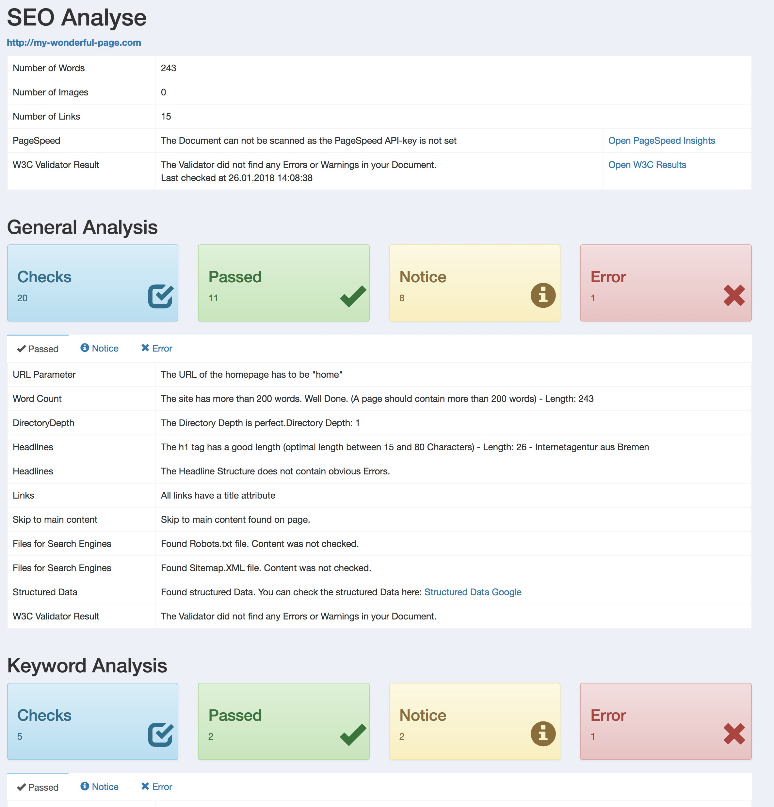

# SEO Hero Tool Analysis

An Addition to SEO Hero Tool which can be also found on Github [SEO Hero Tool on Github](https://github.com/nomidi/silverstripe-seo-hero-tool).
The SEO Hero Tool Analysis extends the functionality of the SEO Hero Tool by adding a Button to each page which on click starts an analysis of the actual website.
This analysis checks several parameters and gives an detailled overview of the findings.



## Creating default settings in the configuration

This definition takes place in the `mysite/_config/config.yml`.

``` yml
SeoHeroToolAnalysis:
  Local: true
  PageSpeedAPI: XXXXXXXXXXXX
  contentID: maincontent
```

### Local
Either `true` or `false`. If this is set to true some Tests will noe be performed like PageSpeed or W3C Analyisis.

### PageSpeedAPI
The PageSpeed API Key which is needed to access the PageSpeed API. To start with PageSpeed Insights API just follow the linnk [PageSpeed Insights API](https://developers.google.com/speed/docs/insights/v4/getting-started).
Without a PageSpeed API Key the PageSpeed can not be obtained.

### contentID
The ID of the Main Content on this site. If there is a valid value for `contentID` all text within this ID will be used for Word Count.

# todo

### Add test cases
Add tests for this tool similar to the tests in SEO Hero Tool.

### Add Travis Support
Now that this tool is public add Travis support for an automated test after each submit.

To add your own Feature Request please use the Github Issues for this project.
